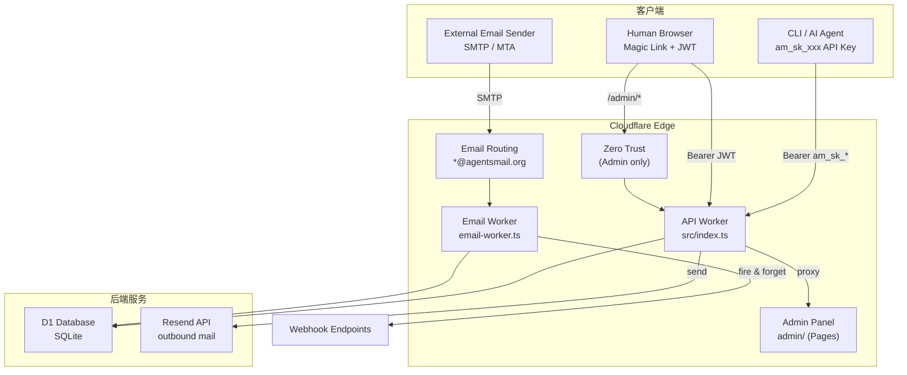
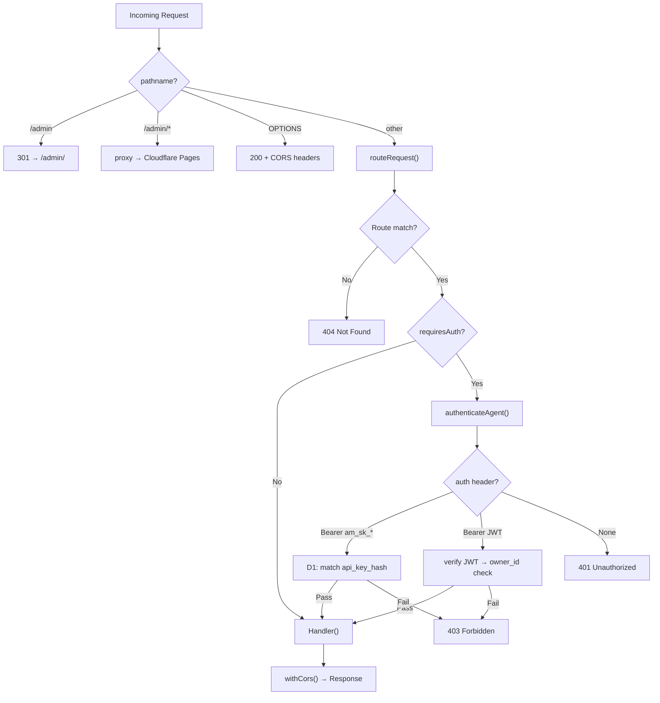
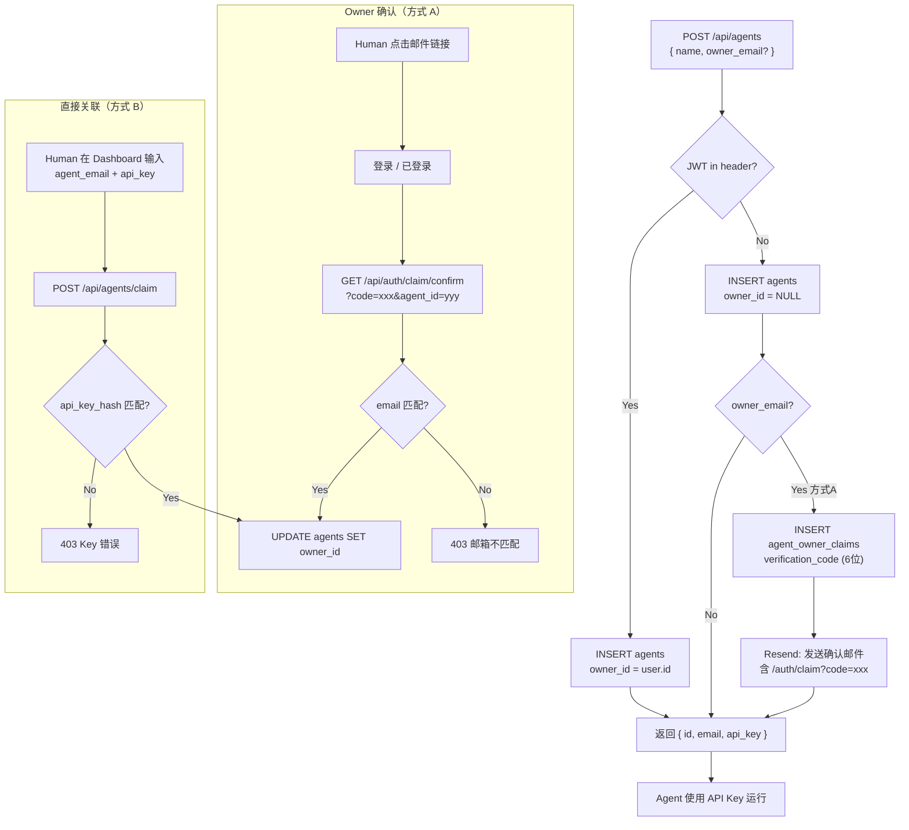
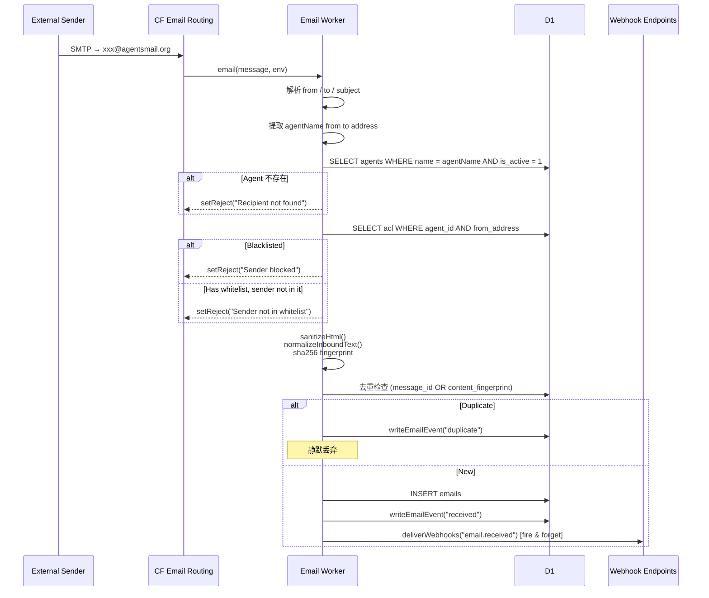
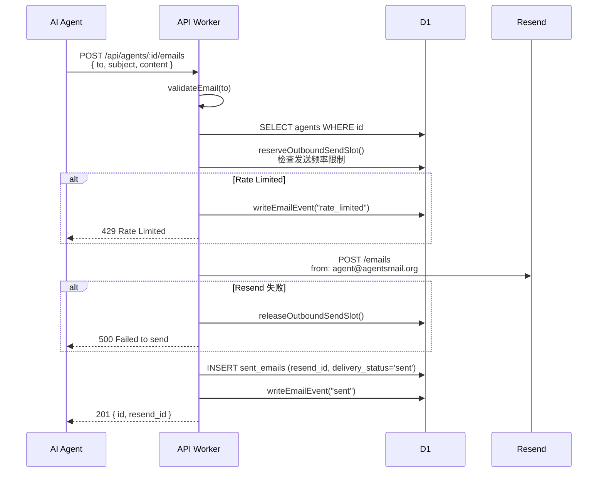
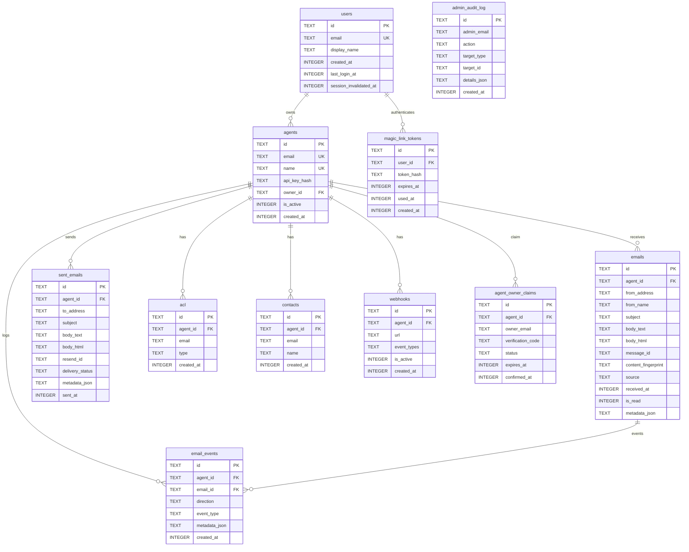
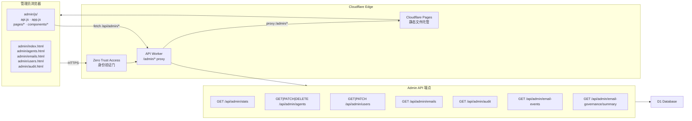

# Agents Mail — 技术架构图集

> v0.2.2 · 2026-03-15

---

## 1. 系统总览

---

## 2. API Worker 请求路由

---

## 3. 双认证模型

```mermaid
sequenceDiagram
    participant Agent as AI Agent / CLI
    participant Human as Human (Browser)
    participant Worker as API Worker
    participant D1

    rect rgb(20, 40, 70)
        Note over Agent, D1: 模式 A — API Key 认证（机器使用）
        Agent->>Worker: POST /api/agents (无认证)
        Worker->>D1: INSERT agents (api_key_hash)
        Worker-->>Agent: { id, email, api_key: "am_sk_xxx" }

        Agent->>Worker: GET /api/agents/:id/emails<br/>Authorization: Bearer am_sk_xxx
        Worker->>D1: SELECT WHERE api_key_hash = sha256(key)
        D1-->>Worker: agent row
        Worker-->>Agent: emails[]
    end

    rect rgb(40, 20, 60)
        Note over Human, D1: 模式 B — Magic Link + JWT 认证（人类使用）
        Human->>Worker: POST /api/auth/magic-link { email }
        Worker->>D1: INSERT magic_link_tokens (token_hash, expires_at+15min)
        Worker->>Resend: send sign-in email
        Human->>Worker: GET /api/auth/verify?token=mlk_xxx
        Worker->>D1: SELECT token, mark used_at
        Worker-->>Human: { token: JWT (7d), user }

        Human->>Worker: GET /api/agents<br/>Authorization: Bearer <JWT>
        Worker->>D1: SELECT WHERE owner_id = user.id
        Worker-->>Human: agents[]
    end
```

---

## 4. Agent 注册 & Owner 关联流程

---

## 5. 邮件接收流程（Inbound）

---

## 6. 邮件发送流程（Outbound）

---

## 7. 数据库 ER 图

---

## 8. Admin 面板架构

---

## 9. 端点速查表

| Method | Path | 认证 | 说明 |
|--------|------|------|------|
| GET | `/` | - | 健康检查 |
| GET | `/.well-known/service` | - | 服务发现 |
| POST | `/api/agents` | - | 创建 Agent |
| GET | `/api/agents` | API Key / JWT | 列出 Agents |
| GET | `/api/agents/:id` | API Key / JWT | 获取 Agent |
| DELETE | `/api/agents/:id` | API Key / JWT | 停用 Agent |
| POST | `/api/auth/magic-link` | - | 发送登录链接 |
| GET | `/api/auth/verify` | - | 验证 Magic Link → JWT |
| POST | `/api/auth/logout` | JWT | 登出 |
| GET | `/api/auth/me` | JWT | 获取当前用户 |
| POST | `/api/agents/claim` | JWT | 通过 API Key 关联 Agent |
| GET | `/api/auth/claim/confirm` | JWT | 通过邮件确认关联 |
| DELETE | `/api/agents/:id/owner` | JWT | 取消关联 |
| GET | `/api/agents/:id/emails` | API Key / JWT | 收件箱（分页+过滤） |
| GET | `/api/agents/:id/emails/:eid` | API Key / JWT | 邮件详情 |
| POST | `/api/agents/:id/emails` | API Key / JWT | 发送邮件 |
| DELETE | `/api/agents/:id/emails/:eid` | API Key / JWT | 删除单封 |
| DELETE | `/api/agents/:id/emails` | API Key / JWT | 批量删除（?before=ts） |
| PUT | `/api/emails/:id/read` | API Key | 标记已读 |
| GET/POST/DELETE | `/api/agents/:id/acl` | API Key / JWT | ACL 管理 |
| GET/POST/DELETE | `/api/agents/:id/contacts` | API Key / JWT | 联系人管理 |
| GET/POST/DELETE | `/api/agents/:id/webhooks` | API Key / JWT | Webhook 管理 |
| POST | `/api/agents/:id/emails/:eid/interpret` | API Key / JWT | AI 解析邮件 |
| GET | `/api/admin/*` | Zero Trust | Admin 管理接口 |
